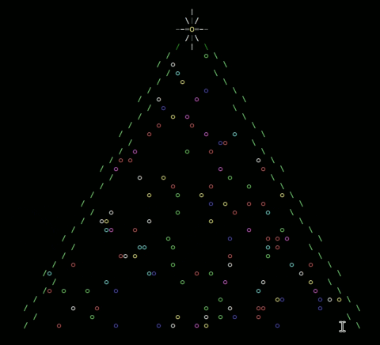

# Christmas Tree (2021)

Terminal Christmas Tree based on curses library

## Description
I wanted to play with the python library curses and I was inspired by the output of the perl module "Acme::POE::Tree"
Therefore I wrote this simple terminal christmas tree

This what you get 



## Getting Started
It was tested in a python virtual environment (Python 3.8.10) on a Ubuntu 20.04 VM

### Dependencies

* numpy (tested with v1.22)

### Installing & Executing program

Clone the reporitory in your virtual environment and run

```
$ python tree.py
```

To quit: CTRL+C

## Contributing

Any suggestions for new features or ideas are welcome.

**Issues**

Feel free to submit issues regarding:

- recommendations
- enhancement requests and new features
- code bugs

**To Do**

- different way to quit program
- Resize of the window doesn't properly resize the tree
- Balls of the tree could change position and colour at a different times


## License

MIT, see [LICENSE](LICENSE)

## Acknowledgments

Inspiration

* [Acme::POE::Tree](https://metacpan.org/pod/Acme::POE::Tree)
